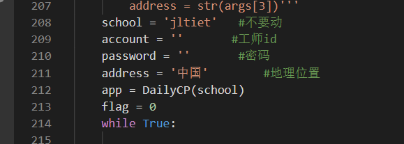

# 吉林工师-今日校园自动签到

## 功能：

每日签到自动签到

## 用法：

输入

```shell
pip install -U -r requirements.txt
```

输入你的id和密码



然后输入

```shell
python .\signin.py
```

出现successed即可签到成功

## 备注：

第一版本未经测试是否可行（因为还有体温什么的，抓不到包），但是pwd_headers.py为抓包模拟登录吉林工师官网的算法，如有大神可以依据此进行二次开发

ps：工师官网的登陆算法属实鬼

## 鸣谢：

Socular：[Socular (Dominic Socular) (github.com)](https://github.com/Socular)

谷玉阳：无博客，无github

DailyCP原项目地址：[LemoFire/DailyCP: 今日校园自动打卡脚本 (github.com)](https://github.com/LemoFire/DailyCP)

